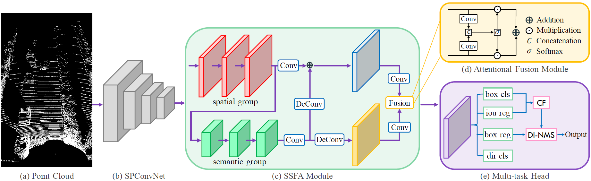

## CIA-SSD: Updated version

Currently state-of-the-art single-stage object detector from point cloud on KITTI Benchmark, running with 32FPS.

## Pipeline

First, input point cloud (a) is encoded with a sparse convolutional network denoted by SPConvNet (b). Then,spatial-semantic feature aggregation (SSFA) module (c) fuses the extracted spatial and semantic features using attentional fusion module (d). After this, confidence function is used for realizing object classification and localization in multi-task head (e). Finally, the distance-variant IoU-weighted NMS (DI-NMS) is formulated for post-processing.
For more detailed information, please refer this [white paper](https://arxiv.org/abs/2012.03015).

## Installation

Download CIA-SSD with [Det3D](https://github.com/INSTALLATION.md) and [spconv](https://github.com/traveller59/spconv).
```bash
$ git clone --recursive git@github.com:Otteri/CIA-SSD.git
```

It is recommended to use conda. Create and activate isolated environment named py38:
```bash
$ conda env create --file=environment.yml
$ conda activate py38
```

Install spconv:
```bash
 $ sudo apt-get install libboost-all-dev
 $ cd spconv && python setup.py bdist_wheel
 $ cd ./dist && pip install *
```

Install Det3D:
```bash
 $ cd Det3D && python setup.py develop
```
Now you are ready to run the model.

### Getting training data

Data is needed for training. Please, refer Det3D [data preparation guide](https://github.com/Otteri/Det3D/blob/master/GETTING_STARTED.md). Let's consider KITTI dataset. Download the [KITTI data](http://www.cvlibs.net/datasets/kitti/eval_object.php?obj_benchmark=3d) and order it as guided. Because Det3D makes path assumptions, it is recommended to place data into: `/data/Datasets/KITTI/`. (*Then download plane data from internet*). After this, we can use Det3D scripts to prepare data for us:

```bash
# Provide absolute path, not relative
python Det3D/tools/create_data.py kitti_data_prep --root_path="<KITTI_DATASET_ROOT>"
```
After data preparation, you may want to check that the model configurations are appropriate inside `configs` folder.
### Training & Evaluation
Now you should be able to train the model (single GPU):
```
python Det3D/tools/train.py configs/<config-file>
```
Evaluation scores will be printed when training finishes. However, you can also evaluate the model whenever you like with:
```
python Det3D/tools/test.py <config> <checkpoint>
```

## System requirements
You need a GPU with over 4GB memory. (With 4GB you might be able to train with batch size of 1 and closing all GUI applications). The code has been tested only on Ubuntu.

## Acknowledgements
- [CIA-SSD](https://github.com/Vegeta2020/CIA-SSD)
- [Det3D](https://github.com/poodarchu/Det3D)
- spconv
- KITTI

## License
This codebase is released under the Apache 2.0 license.

## FAQ

RuntimeError: CUDA out of memory. Tried to allocate 18.00 MiB (GPU 0; 3.82 GiB total capacity; 799.32 MiB already allocated; 42.81 MiB free; 848.00 MiB reserved in total by PyTorch)

Reduce memory consumption somehow. You may try setting smaller batch number from config.
